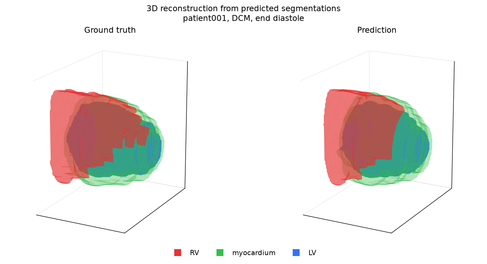
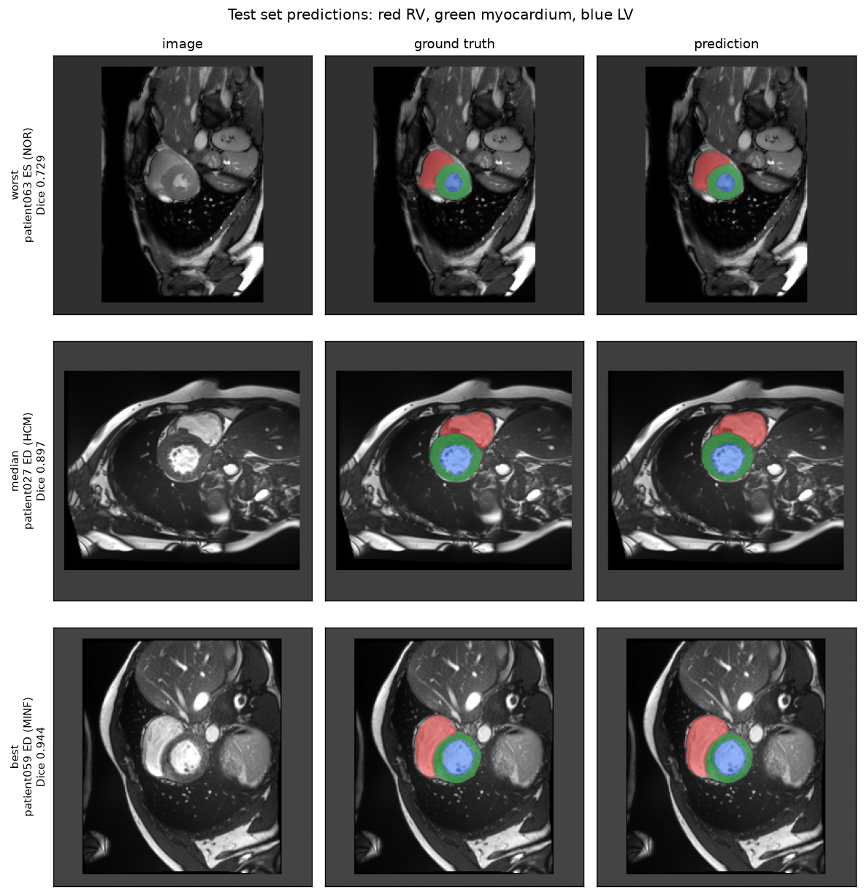
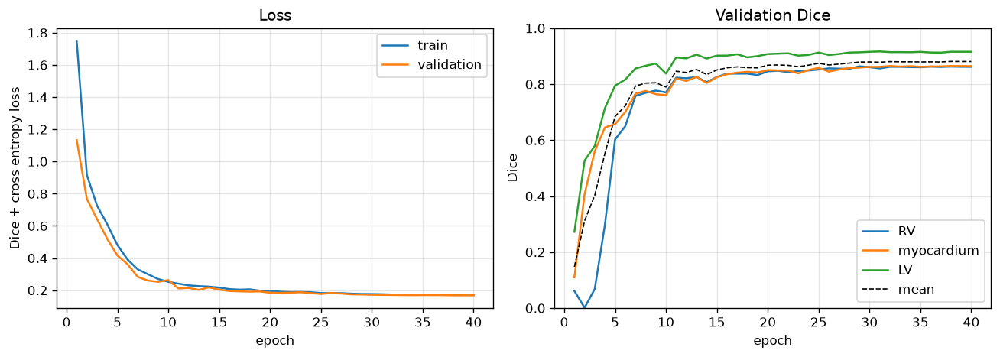
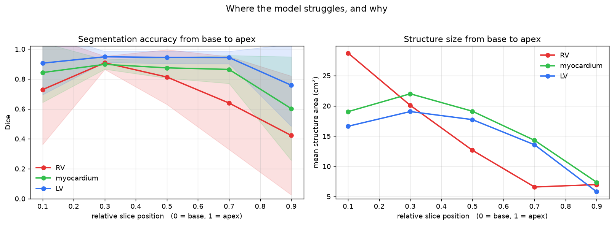
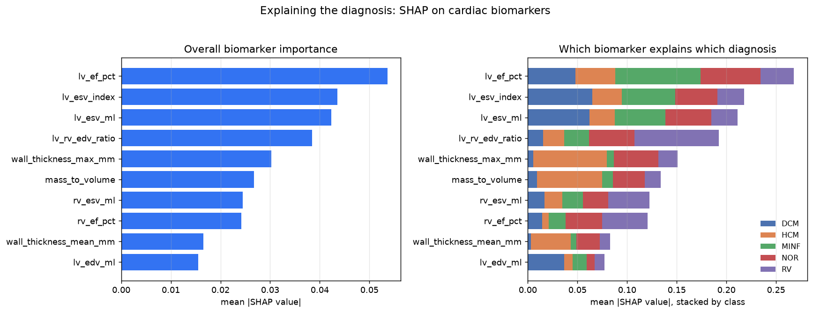
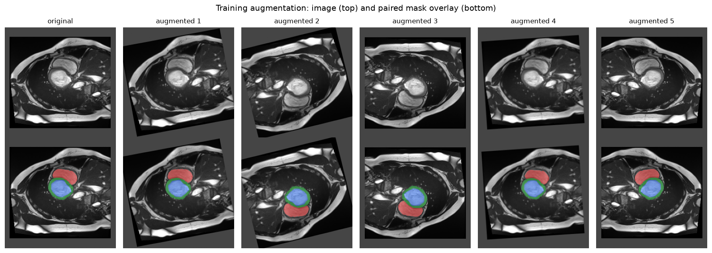

# Trustworthy Cardiac MRI: From Segmentation to Explainable Diagnosis

An end-to-end cardiac MRI pipeline that segments the heart, derives clinical
measurements from those segmentations, and produces an explainable diagnosis.
The project targets three properties that matter for clinical deployment but
are often omitted from segmentation studies: **interpretability**,
**uncertainty awareness**, and **generalisation across scanners**.

Every stage is validated rather than assumed. Unit conversions are tested
against geometry of known volume, cropping is proven lossless, augmentation is
proven spatially aligned, data splits are proven non-overlapping, and the
label convention of an external dataset is determined empirically rather than
taken from its documentation.

---

## Results at a glance

| Stage | Result |
|---|---|
| Segmentation (ACDC held-out test) | **0.875** mean Dice, HD95 4.4 to 10.1 mm |
| Biomarker agreement with ground truth | **r ≥ 0.98** for ventricular volumes and myocardial mass |
| Diagnosis, fully end to end | **86.7%** across five conditions |
| Uncertainty calibration | **r = −0.73** between uncertainty and error |
| Clinical triage | reviewing the least confident **20%** of slices surfaces **92.6%** of failures |
| Cross-vendor generalisation | **3.5%** relative Dice drop on unseen scanners, zero-shot |

The diagnosis figure is fully end to end: an image enters, the network
segments it, biomarkers are computed from the predicted masks, and the
classifier diagnoses from those. No ground truth is used anywhere in that path.



*Ground truth and predicted anatomy, reconstructed in 3D from 2D slice predictions.*

---

## Pipeline
MRI volume
↓ 2D U-Net segmentation (RV, myocardium, LV cavity)
↓ largest connected component per structure
segmentation masks
↓ voxel counting with physical spacing
clinical biomarkers (volumes, ejection fractions, mass, wall thickness)
↓ Random Forest + SHAP
explained diagnosis
Running alongside: Monte Carlo dropout produces a per-slice confidence
estimate, and the trained model is evaluated zero-shot on a second,
multi-vendor dataset.

---

## Data

**ACDC** (Automated Cardiac Diagnosis Challenge, MICCAI 2017). 100 patients
from a single centre in Dijon on two Siemens scanners, evenly split across
five diagnosis groups. Used for training and primary evaluation.

**M&Ms** (Multi-Centre, Multi-Vendor and Multi-Disease, MICCAI 2020). Studies
from Siemens, Philips, GE and Canon scanners across hospitals in Spain,
Germany and Canada. Used only for zero-shot generalisation testing; 34
patients from the open validation set.

Imaging data is not included in this repository. Both datasets require
registration and agreement to their respective terms of use.

**Required citations.** Both datasets mandate citation of their challenge
publications in any work using them:

> Bernard, O., Lalande, A., Zotti, C., Cervenansky, F. et al. (2018) 'Deep
> learning techniques for automatic MRI cardiac multi-structures segmentation
> and diagnosis: is the problem solved?', *IEEE Transactions on Medical
> Imaging*, 37(11), pp. 2514-2525. doi: 10.1109/TMI.2018.2837502

> Campello, V.M., Gkontra, P., Izquierdo, C., Martin-Isla, C. et al. (2021)
> 'Multi-centre, multi-vendor and multi-disease cardiac segmentation: the
> M&Ms challenge', *IEEE Transactions on Medical Imaging*, 40(12),
> pp. 3543-3554. doi: 10.1109/TMI.2021.3090082

### Measured dataset properties

Profiling all 100 ACDC patients before any modelling shaped every
preprocessing decision:

| Property | Range | Consequence |
|---|---|---|
| Diagnosis groups | 20 patients each | Balanced; no class weighting required |
| Image dimensions | 154–428 × 154–512 | Crop and pad to a fixed 256 × 256 |
| Slices per volume | 6 to 18 | Build the dataset as a flat slice list |
| In-plane spacing | 0.70 to 1.92 mm | Resample to a common 1.5 mm |
| Slice thickness | 5 to 10 mm | Strongly anisotropic, motivating 2D over 3D |
| Intensity maximum | 184 to 4025 | Per-slice normalisation required |

The 2.7-fold variation in spacing and 20-fold variation in intensity maxima
are the two properties that would most damage training if left unaddressed.

---

## Segmentation

A 2D U-Net (6.5M parameters, MONAI), trained for 40 epochs with a combined
Dice and cross-entropy loss, AdamW, and a cosine learning-rate schedule.
Training took 25 minutes on an Apple M-series laptop GPU.

Metrics are computed **per volume**, after reassembling slices into patient
and phase volumes, so they are directly comparable with published ACDC results
rather than to per-slice figures.

| Structure | Dice | HD95 (mm) | nnU-Net Dice |
|---|---|---|---|
| Right ventricle | 0.833 ± 0.102 | 10.08 | 0.906 |
| Myocardium | 0.862 ± 0.044 | 6.87 | 0.902 |
| Left ventricle cavity | 0.931 ± 0.050 | 4.44 | 0.943 |
| **Mean** | **0.875 ± 0.050** | | 0.917 |

nnU-Net figures (Isensee et al., 2021) are given for context, not as a like
for like comparison: that system uses extensive automated configuration and
ensembling.



*Worst, median and best test volumes. Left to right: image, ground truth, prediction.*



### Post-processing

Keeping only the largest connected component per structure, motivated by the
fact that a heart contains exactly one of each, improved both metrics:

| Structure | Dice before | Dice after | HD95 before | HD95 after |
|---|---|---|---|---|
| Right ventricle | 0.819 | 0.833 | 27.33 | 10.08 |
| Myocardium | 0.859 | 0.862 | 10.66 | 6.87 |
| Left ventricle cavity | 0.916 | 0.931 | 11.16 | 4.44 |

The large Hausdorff reduction reflects small disconnected false positives far
from the heart. Dice is relatively insensitive to these; Hausdorff distance is
dominated by them. Reporting both makes the failure mode visible.

### Error analysis

Aggregate Dice conceals substantial variation with slice position:

| Position | RV | Myocardium | LV |
|---|---|---|---|
| Base (0.0–0.2) | 0.729 | 0.843 | 0.906 |
| 0.2–0.4 | 0.908 | 0.898 | 0.949 |
| Mid (0.4–0.6) | 0.813 | 0.875 | 0.944 |
| 0.6–0.8 | 0.639 | 0.864 | 0.943 |
| Apex (0.8–1.0) | 0.423 | 0.602 | 0.759 |



Performance is non-monotonic: it dips at the base, where the ventricle
boundary is ambiguous near the valve plane, peaks just below it, then falls
sharply toward the apex. Right ventricle cross-sectional area falls roughly
four-fold from base to apex, and Dice tracks that reduction closely. Small
structures are penalised heavily because boundary pixels form a large fraction
of their area.

---

## Clinical biomarkers

Segmentations are converted into the measurements used in cardiology:
ventricular volumes at end diastole and end systole, ejection fractions,
myocardial mass, wall thickness, and body-surface-area-indexed equivalents.
Volume is computed from voxel counts using the preprocessed in-plane spacing
and each patient's original slice thickness. All formulas are verified against
shapes of known volume in the module self-test.

### Clinical validity

Biomarkers derived from ground truth masks reproduce the defining features of
each diagnosis group, with no fitting:

| Group | LVEDV (mL) | LV EF (%) | RV EF (%) | LV mass (g) | Max wall (mm) |
|---|---|---|---|---|---|
| Normal | 130.3 | 60.4 | 55.1 | 102.0 | 8.7 |
| Dilated cardiomyopathy | 285.0 | 18.3 | 31.9 | 170.0 | 9.1 |
| Hypertrophic cardiomyopathy | 128.8 | 67.7 | 59.7 | 177.4 | 13.8 |
| Myocardial infarction | 172.2 | 31.0 | 55.4 | 122.8 | 9.8 |
| Abnormal right ventricle | 107.1 | 54.7 | 31.4 | 77.4 | 8.0 |

Dilated cardiomyopathy shows a markedly enlarged ventricle with severely
reduced ejection fraction; hypertrophic cardiomyopathy shows the greatest mass
and wall thickness with preserved ejection fraction; and the abnormal right
ventricle group is the only one in which right ventricular function falls
while left ventricular function is spared.

### Agreement between predicted and ground truth biomarkers

| Biomarker | Bias | 95% limits of agreement | r |
|---|---|---|---|
| LV EDV (mL) | −2.45 | −15.41 to 10.50 | 0.997 |
| LV ESV (mL) | 1.39 | −16.35 to 19.13 | 0.994 |
| LV EF (%) | −2.47 | −14.14 to 9.21 | 0.955 |
| RV EDV (mL) | 1.85 | −19.66 to 23.37 | 0.981 |
| RV EF (%) | −8.43 | −26.92 to 10.06 | 0.850 |
| LV mass (g) | 5.96 | −12.10 to 24.02 | 0.984 |
| Max wall thickness (mm) | 0.19 | −1.76 to 2.13 | 0.923 |

Left-sided measurements agree closely. Right ventricular ejection fraction is
weakest, with a systematic 8.4 percentage point underestimate. This is
consistent with the slice-position analysis: apical RV Dice falls to 0.42, and
errors on the smallest slices propagate most strongly into end systolic
volume, which appears in the numerator of ejection fraction. Two independent
analyses identify the same weakness.

---

## Explainable diagnosis

A Random Forest classifies the five diagnosis groups from the biomarkers, and
SHAP identifies which measurements drive each prediction.

| Evaluation | Accuracy | Patients |
|---|---|---|
| 5-fold cross validation, ground truth biomarkers | 0.859 | 85 |
| **End to end, biomarkers from predicted segmentations** | **0.867** | 15 |
| Test patients, ground truth biomarkers | 1.000 | 15 |

The test set contains only 15 patients, so each corresponds to 6.7 percentage
points; the cross-validated figure is the more stable estimate and the end to
end figure the more honest one.

### What the model uses

SHAP recovers the clinically established discriminator for each condition
without any supervision on feature relevance:

| Group | Top biomarkers | Clinical interpretation |
|---|---|---|
| Dilated cardiomyopathy | LV ESV index, LV ESV, LV EF | Enlarged ventricle emptying poorly |
| Hypertrophic cardiomyopathy | Max and mean wall thickness, mass to volume ratio | Thickened myocardium |
| Myocardial infarction | LV EF, LV ESV index | Impaired contraction |
| Normal | LV EF | Preserved systolic function |
| Abnormal right ventricle | LV to RV volume ratio, RV EF, RV ESV | Right-sided dysfunction with spared left ventricle |



*Left: overall biomarker importance. Right: which biomarker explains which diagnosis.*

Left ventricular ejection fraction is the single most influential biomarker
overall, followed by end systolic volume measures.

Errors concentrate on the myocardial infarction and dilated cardiomyopathy
boundary, which is expected: both present with reduced ejection fraction and
are distinguished clinically by wall motion pattern rather than global
function.

---

## Uncertainty estimation

Dropout was enabled during training, so Monte Carlo dropout required no
retraining: dropout layers are reactivated at inference and twenty stochastic
forward passes are run per slice.

### Measuring uncertainty in the right place

Averaged over the whole slice, entropy correlates only weakly with error
(r = −0.11) and appears to *fall* toward the apex, implying the model is most
confident where it performs worst. This is an artefact of the measurement: a
slice is overwhelmingly confident background, and apical slices contain the
smallest structures, so a slice-wide mean measures structure size rather than
confidence.

Restricting the average to the predicted foreground plus a 12-pixel margin,
the region where the segmentation decision is actually made, removes the
confound:

| Measure | Correlation with slice Dice |
|---|---|
| Whole-slice entropy | −0.112 |
| Whole-slice variance | −0.422 |
| **Decision-region entropy** | **−0.727** |
| **Decision-region variance** | **−0.782** |

### Calibration

| Uncertainty quartile | Mean Dice |
|---|---|
| Lowest | 0.896 |
| Second | 0.865 |
| Third | 0.820 |
| Highest | 0.543 |

Uncertainty is U-shaped with slice position, mirroring accuracy:

| Position | Entropy | Dice |
|---|---|---|
| Base (0.0–0.2) | 0.132 | 0.796 |
| 0.2–0.4 | 0.099 | 0.911 |
| Mid (0.4–0.6) | 0.106 | 0.867 |
| 0.6–0.8 | 0.107 | 0.807 |
| Apex (0.8–1.0) | 0.138 | 0.573 |

The model is most uncertain at the base and apex, the two regions
independently identified as hardest in the error analysis, without being given
any information about slice position.

### Clinical triage

| Slices flagged for review | Share of the worst 10% caught |
|---|---|
| Most uncertain 5% | 48.1% |
| Most uncertain 10% | 59.3% |
| Most uncertain 20% | 92.6% |

Reviewing the least confident fifth of slices would surface almost all
genuinely poor segmentations, which is the practical form a trustworthy
deployment would take.

---

## Cross-scanner generalisation

The ACDC-trained model was applied to M&Ms with no retraining and no fine
tuning.

### Label convention, verified not assumed

M&Ms labels the LV cavity as 1 and the RV as 3, the reverse of ACDC. Rather
than trust the published convention, it is verified geometrically: the LV
cavity is enclosed by myocardium and the RV is not, so the fraction of a
structure's surroundings that is myocardium identifies the correct mapping.
Measured over 40 slices, label 1 scored 0.982 and label 3 scored 0.233,
confirming that remapping is required.

Without this step, RV predictions would be scored against LV ground truth and
the resulting near-zero Dice would be misread as catastrophic domain shift.

### Zero-shot results

| Structure | ACDC test | M&Ms zero-shot |
|---|---|---|
| Right ventricle | 0.833 | 0.826 |
| Myocardium | 0.862 | 0.819 |
| Left ventricle cavity | 0.931 | 0.889 |
| **Mean** | **0.875** | **0.845** |

Mean Dice falls by 0.030, a relative drop of 3.5%. Retaining this level of
performance across unseen vendors and centres without adaptation suggests the
per-slice percentile normalisation and intensity augmentation used during
training were effective, since these target precisely the intensity
variability that differs most across scanners.

### Where performance actually drops

Aggregated by vendor, Siemens appears weakest, but this is an artefact of
sample size: Vendor A contributes only 4 patients, its median Dice (0.846) is
comparable to GE (0.850) and Canon (0.860), and the low mean (0.744) is driven
by two hypertrophic cases.

The consistent effects are pathology and cardiac phase:

| Pathology | Median Dice | n volumes |
|---|---|---|
| Hypertrophic cardiomyopathy | 0.832 | 20 |
| Hypertensive heart disease | 0.835 | 8 |
| Athlete's heart syndrome | 0.838 | 2 |
| Normal | 0.882 | 18 |
| Dilated cardiomyopathy | 0.883 | 16 |
| Abnormal right ventricle | 0.898 | 2 |

| Phase | Median Dice |
|---|---|
| End diastole | 0.878 |
| End systole | 0.848 |

Hypertrophic cardiomyopathy is hardest across all vendors, and end systole is
consistently harder than end diastole. Both are consistent with accuracy
tracking structure size: end systolic chambers are smaller, and hypertrophy
thickens the myocardium while narrowing the cavity.

Hypertrophic cases on Vendor A are notably poor (median 0.578 against 0.837 to
0.871 elsewhere), but with four volumes from two patients a vendor effect
cannot be separated from a pathology effect, and no such claim is made.

---

## Methodology

### Preprocessing

| Step | Choice | Reason |
|---|---|---|
| Resampling | 1.5 mm in-plane; bilinear for images, nearest for masks | Measured spacing varies 2.7-fold |
| Normalisation | Per-slice, 1st–99th percentile clip then z-score | MRI has no absolute scale; maxima vary 20-fold |
| Spatial size | Centre crop or zero pad to 256 × 256 | Dimensions vary from 154 to 512 |
| Splits | Patient level, stratified by group, 70/15/15 | Slices from one heart are correlated |
| Caching | Preprocessed once to compressed float16 archives | Avoids repeated decompression |
| Augmentation | Rotation, zoom, flips, intensity scale and shift | Geometric transforms applied identically to image and mask |



*Training augmentation. The mask follows the image exactly through rotation, zoom and flips.*

Resulting dataset: 1356 training, 284 validation, 262 test slices.

### Correctness checks

Rather than assume the pipeline is sound, each risk is measured:

- **Cropping is lossless.** `crop_retention` confirms centre cropping removes no labelled pixels for any patient. An initial version of this check compared masks before and after *resampling*, conflating two effects and producing a false alarm; the corrected version isolates cropping alone.
- **Augmentation preserves alignment.** Image and mask remain spatially aligned through random transforms (worst-case IoU 0.921 over 300 augmentations, with the residual gap explained by bilinear versus nearest interpolation at boundaries).
- **Splits do not leak.** Assertions confirm all 100 patients are assigned and none appears in more than one split.
- **Biomarker units are correct.** Volume, ejection fraction, body surface area and wall thickness are each tested against geometry with a known answer.
- **External label conventions are measured.** See the M&Ms section above.

### Model

2D U-Net, 6,496,585 parameters, channels (32, 64, 128, 256, 512), two residual
units per block, dropout 0.1. A 2D architecture is used deliberately: slice
thickness of 5 to 10 mm against 1.5 mm in-plane resolution means 3D
convolutions would operate over highly anisotropic voxels. Dropout is included
from the start so that Monte Carlo dropout uncertainty requires no retraining.

---

## Repository structure
src/data/ loading, preprocessing, splits, caching, M&Ms loader
src/models/ U-Net definition and training loop
src/evaluation/ metrics, post-processing, biomarkers, diagnosis,
uncertainty, cross-vendor evaluation, figures
results/figures/ output figures
results/metrics/ numerical results and dataset summaries
data/ raw and preprocessed data (not tracked)
## Reproducing

```bash
python3 -m venv .venv
source .venv/bin/activate
pip install -r requirements.txt

python -m src.data.explore            # dataset profiling
python -m src.data.splits             # patient-level splits
python -m src.data.cache              # preprocessing
python -m src.models.train --epochs 40
python -m src.evaluation.evaluate     # segmentation metrics
python -m src.evaluation.extract_biomarkers
python -m src.evaluation.diagnose     # classification and SHAP
python -m src.evaluation.uncertainty
python -m src.evaluation.evaluate_mnms
```

ACDC and M&Ms must be downloaded separately after agreeing to their
respective terms.

---

## Limitations

- The held-out test set contains 15 patients, so diagnosis accuracy is coarse; the cross-validated estimate over 85 patients is more reliable.
- The ACDC test split happened to contain only 10 mm slice thickness cases, making it slightly less acquisition-diverse than the training data.
- Wall thickness uses a concentric-circle approximation and averages around the ventricular ring. Hypertrophic cardiomyopathy is typically asymmetric septal hypertrophy, so focal thickening is diluted: the measured group mean of 13.8 mm sits below the clinical threshold of 15 mm despite the group being correctly separated.
- Right ventricular ejection fraction is systematically underestimated by 8.4 percentage points, traceable to poor apical RV segmentation.
- Only 34 M&Ms patients were used, with 4 from one vendor, which limits per-vendor conclusions.
- Uncertainty is estimated by Monte Carlo dropout alone; deep ensembles or test-time augmentation were not compared.

---

## References

Bernard, O. et al. (2018) 'Deep learning techniques for automatic MRI cardiac
multi-structures segmentation and diagnosis: is the problem solved?', *IEEE
Transactions on Medical Imaging*, 37(11), pp. 2514–2525.

Campello, V.M. et al. (2021) 'Multi-centre, multi-vendor and multi-disease
cardiac segmentation: the M&Ms challenge', *IEEE Transactions on Medical
Imaging*, 40(12), pp. 3543–3554.

Ronneberger, O., Fischer, P. and Brox, T. (2015) 'U-Net: convolutional
networks for biomedical image segmentation', in *Medical Image Computing and
Computer-Assisted Intervention (MICCAI 2015)*. Cham: Springer, pp. 234–241.

Isensee, F. et al. (2021) 'nnU-Net: a self-configuring method for deep
learning-based biomedical image segmentation', *Nature Methods*, 18(2),
pp. 203–211.

Lundberg, S.M. and Lee, S.-I. (2017) 'A unified approach to interpreting model
predictions', *Advances in Neural Information Processing Systems*, 30,
pp. 4765–4774.

Gal, Y. and Ghahramani, Z. (2016) 'Dropout as a Bayesian approximation:
representing model uncertainty in deep learning', in *Proceedings of the 33rd
International Conference on Machine Learning*, pp. 1050–1059.

---

## Author

**Nivedita Saha**
[nivsaha.com](https://nivsaha.com) · sahanivedita10@gmail.com
